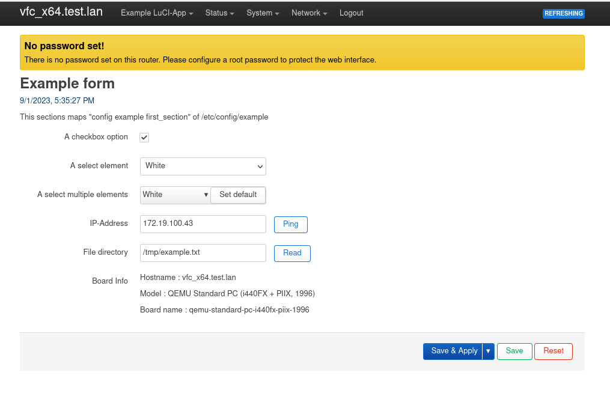
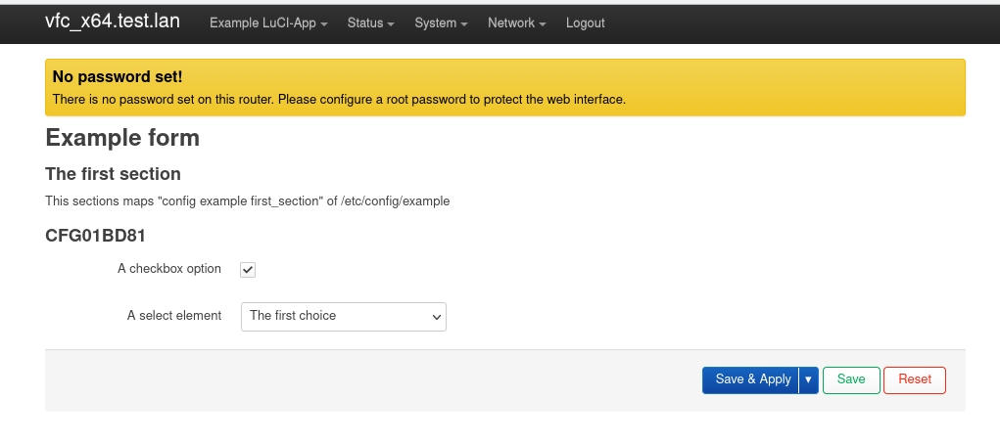
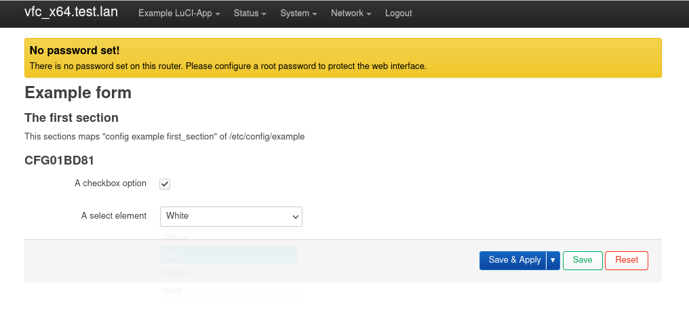
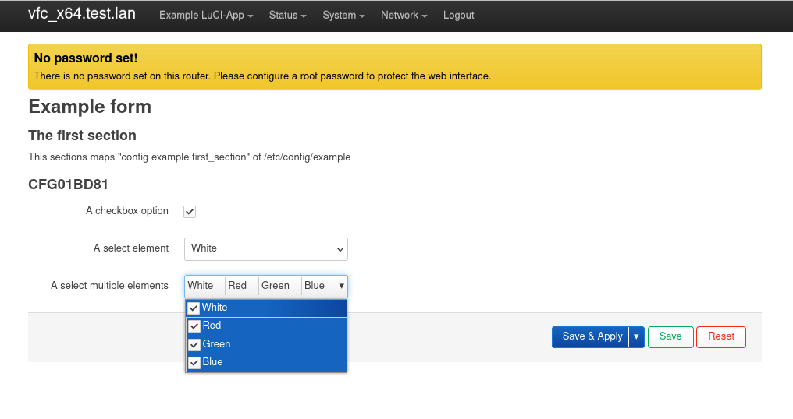
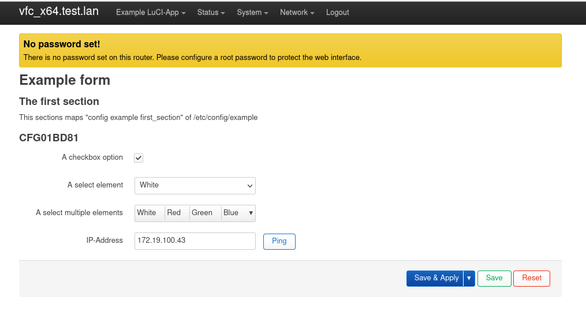
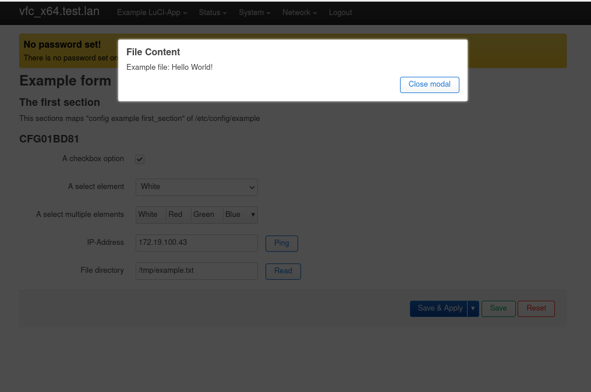

<!-- PROJECT LOGO -->
<br />
<div align="center">
  <a href="[OpenWRT Wiki](https://openwrt.org/start)">
      
  </a>

  <h3 align="center">Client side LuCI Documentation</h3>

  <p align="center">
    Writing a simple LuCI app with JavaScript API
    <br />
  </p>
</div>


<!-- TABLE OF CONTENTS -->
<details>
  <summary>Table of Contents</summary>
  <ol>
    <li>
      <a href="#about-the-project">LuCI App Preview</a>
    </li>
    <li>
      <a href="#prerequisites">Prerequisites</a>
    </li>
    <li>
      <a href="#writingapp">Writing a LuCI App</a>
      <ul>
        <li><a href="#settingapp">Setting up</a></li>
        <li><a href="#form">Creating a form</a></li>
        <li><a href="#listvalue">ListValue</a></li>
        <li><a href="#multivalue">MultiValue</a></li>
        <li><a href="#pingbutton">Ping button and ui.ping</a></li>
        <li><a href="#readfile">fs.read + ui.showModal</a></li>
        <li><a href="#rpc">rpc call</a></li>
        <li><a href="#uciset">uci set changes</a></li>
        <li><a href="#poll">Dynamic page</a></li>
      </ul>
    </li>
 
  </ol>
</details>


<!-- LuCI App Preview -->
## LuCI App Preview



LuCI JavaScript-API renders views on the client side, resulting in accelerated performance of the Web interface and offering developers more convenient tools for web interface creation.
This tutorial will demonstrate how to create a simple LuCI form view using the JavaScript API

<p align="right">(<a href="#readme-top">back to top</a>)</p>


<!-- Prerequisites -->
## Prerequisites

LuCI apps are typically developed for embedded Linux systems like routers, so you'll need access to such a system for testing and deployment. Here are the prerequisites and steps to get started:
  <ol>
    <li>
      Setup OpenWrt Environment:
      <ul>
        <li>You need access to an OpenWrt-based device, such as a router or a virtual machine running OpenWrt.</li>
        <li>Make sure you can SSH into your OpenWrt device and have basic knowledge of Linux commands.</li>
      </ul>
    </li>
    <li>
      LuCI Installed:
      <ul>
        <li>Ensure that LuCI (Luci web interface) is installed on your OpenWrt device. It is usually included in the default OpenWrt firmware.</li>
      </ul>
    </li>
    <li>
      Development Tools:
      <ul>
        <li>You'll need a text editor or Integrated Development Environment (IDE) for coding JavaScript. Popular choices include Visual Studio Code, Sublime Text, or even simple editors like Notepad++.</li>
      </ul>
    </li>
    <li>
      Basic JavaScript and Web Development Knowledge
    </li>
    <li>
      Familiarity with OpenWrt and LuCI
    </li>
  </ol>

<p align="right">(<a href="#readme-top">back to top</a>)</p>


<!-- Writing App -->
## Writing an LuCI App

### Setting up
*menu.d
You need this file routing
*acl.d
We will create an App that will use two uci files and txt file
  ```uci
config first_section
	option some_bool '1'
	option some_address '172.19.100.43'
	option some_file_dir '/tmp/example.txt'
  ```
  ```uci
config some_choice
	option id '1234'
	option choice 'Red'

config some_choice
	option id '4231'
	option descr 'Green'

config some_choice
	option id '4321'
	option descr 'Blue'
  ```

### Creating a form
Let's map the **example** configuration file

  ```js
'use strict';
'require form';

return L.view.extend({
    render: function () {
        var m, s, o;

        m = new form.Map('example', 'Example form');
        
        s = m.section(form.TypedSection, 'first_section', 'The first section',
            'This sections maps "config example first_section" of /etc/config/example');
        //s.anonymous = true;
        
        o = s.option(form.Flag, 'some_bool', 'A checkbox option');
        
        o = s.option(form.ListValue, 'some_choice', 'A select element');
        o.value('choice1', 'The first choice');
        o.value('choice2', 'The second choice');

        return m.render()
    }
});
  ```


### ListValue
Let's read values for ListValue from **example_helper**

  ```js
'use strict';
'require form';
'require uci';

return L.view.extend({
    load: function () {
        return Promise.all([
            uci.load('example_helper')
        ]);
    },
    render: function () {   
        var m, s, o;

        m = new form.Map('example', 'Example form');
        
            s = m.section(form.TypedSection, 'first_section', 'The first section',
            'This sections maps "config example first_section" of /etc/config/example');
        
        o = s.option(form.Flag, 'some_bool', 'A checkbox option');
        
        o = s.option(form.ListValue, 'some_choice', 'A select element');

        var choiceList = uci.sections('example_helper', 'some_choice')

        choiceList.forEach(choice => o.value(choice['id'], choice['name']));

        return m.render()
    }
});
  ```


### MultiValue
Add following option to the section
  ```js
        o = s.option(form.MultiValue, "multi_choice", "A select multiple elements")
        choiceList.forEach(choice => o.value(choice['name']));
        o.display_size = 4;
  ```
Multivalue saves values by default in the following form:
  ```uci
list multichoice 'White'
list multichoice 'Red'
list multichoice 'Green'
  ```
To save **multi_choice** option like:
  ```uci
option multichoice 'White Red Green'
  ```
you can overwrite the option's write function:
  ```js
        o.write = function (section_id, value) {
            uci.set('example', section_id, 'multi_choice', value.join(' '));
        }
  ```


### Ping button and ui.ping
Create a  custom option value node that pings IP Address. To create new DOM Elements LuCI uses **E()** function which is alias for  [LuCI.dom.create()](https://openwrt.github.io/luci/jsapi/LuCI.dom.html#create)

First *'require ui'*  that has pingDevice() function and also needed to create a handler function to an element. You can change a default value node by extending it:
  ```js
var CBIPingAddress = form.Value.extend({
    renderWidget: function (section_id, option_index, cfgvalue) {
        var node = this.super('renderWidget', [section_id, option_index, cfgvalue]);
        
        dom.append(node,
            E('button', {
                'class': 'btn cbi-button-edit',
                'id': 'custom-ping-button',
                'style': 'vertical-align: bottom; margin-left: 1em;',
                'click': ui.createHandlerFn(this, function () {
                    L.resolveDefault(ui.pingDevice('http', cfgvalue), 'error').then(
                        result => {
                            if (result === 'error') alert('ERROR: Device ' + cfgvalue + ' is not reachable');
                            else if (result === 'null') alert('The connectivity check timed out');
                            else alert('Device ' + cfgvalue + ' is reachable');
                        })
                        .catch((error) => {
                            alert(error)
                        });
                })
            }, 'Ping'))
        return node
    }
});
  ```
And then add CBIPingAddress to the section:
  ```js
  o = s.option(CBIPingAddress, 'some_address', 'IP-Address');
  ```


### fs.read + ui.showModal
first you need fs module

And then create a custom option value node similar to CBIPingAddress
  ```js
  var CBIReadFile = form.Value.extend({
    renderWidget: function (section_id, option_index, cfgvalue) {
        var node = this.super('renderWidget', [section_id, option_index, cfgvalue]);
        dom.append(node,
            E('button', {
                'class': 'btn cbi-button-edit',
                'style': 'vertical-align: bottom; margin-left: 1em;',
                'click': ui.createHandlerFn(this, function () {
                    L.resolveDefault(fs.read(cfgvalue), 'Error: Could not read file').then(
                        result => {
                                ui.showModal(_('File Content'), [
                                    E('p', _(result)),
                                    E('div', { 'class': 'right' }, [
                                        E('button', {
                                            'class': 'btn cbi-button-edit',
                                            'click': ui.createHandlerFn(this, function () {
                                                ui.hideModal();
                                            })
                                        }, [_('Close modal')]),

                                    ])
                                ]);
                        })
                }),
            }, 'Read'))
        return node
    }
});
  ```

something about ui.ShowModal


### rpc call
  ```js
  var boardInfo = rpc.declare({
    object: 'system',
    method: 'board',
    params: [],
    expect: {}
});

var CBIBoardInfo = form.TextValue.extend({
    renderWidget: function (section_id, option_index, cfgvalue) {
        var node = this.super('renderWidget', [section_id, option_index, cfgvalue]);
        
        L.resolveDefault(boardInfo(), 'unknown').then(function (result) {
            console.log(result)
            var contentNode = [
                E('p', {}, 'Hostname : ' + result['hostname']),
                E('p', {}, 'Model : ' + result['model']),
                E('p', {}, 'Board name : ' + result['board_name'])
            ]

            dom.content(node, contentNode)
        })

        return node
    }
});
  ```


### uci set changes
To save changes made to a form you need click on Save&Apply button.
Let's customize the MultiValue:
  ```js
  var CBIMultiValue = form.MultiValue.extend({
    renderWidget: function (section_id, option_index, cfgvalue) {
        var node = this.super('renderWidget', [section_id, option_index, cfgvalue]);

        dom.append(node,
            E('button', {
                'class': 'btn cbi-button-default',
                'style': '',
                'click': ui.createHandlerFn(this, function () {

                    uci.set('example', section_id, 'multi_choice', 'White');
                    uci.save()
                        .then(L.bind(ui.changes.init, ui.changes))
                        .then(L.bind(ui.changes.apply, ui.changes))
                        .then(ui.hideModal());
                })
            }, 'Set default'))

        return node
    }
});
  ```

Something about uci.save and the blablabla


### Dynamic page
You can add jquery library in header.htm in the corresponding theme folder.
  ```js
function showCurrentTime() {
    var date = new Date().toLocaleString();

    var datetimeNode = E('p', {'class' : '', 'style': 'color: #004280;'}, date)
    $('h3').html(datetimeNode)
}
  ```
Before calling m.render function
  ```js
        $(document).ready(function () {
            var pollfunction = L.bind(showCurrentTime, this);
            poll.add(pollfunction, 1);
        });
  ```


<p align="right">(<a href="#readme-top">back to top</a>)</p>


<!-- MARKDOWN LINKS & IMAGES -->
<!-- https://www.markdownguide.org/basic-syntax/#reference-style-links -->
[contributors-shield]: https://img.shields.io/github/contributors/othneildrew/Best-README-Template.svg?style=for-the-badge
[contributors-url]: https://github.com/othneildrew/Best-README-Template/graphs/contributors
[forks-shield]: https://img.shields.io/github/forks/othneildrew/Best-README-Template.svg?style=for-the-badge
[forks-url]: https://github.com/othneildrew/Best-README-Template/network/members
[stars-shield]: https://img.shields.io/github/stars/othneildrew/Best-README-Template.svg?style=for-the-badge
[stars-url]: https://github.com/othneildrew/Best-README-Template/stargazers
[issues-shield]: https://img.shields.io/github/issues/othneildrew/Best-README-Template.svg?style=for-the-badge
[issues-url]: https://github.com/othneildrew/Best-README-Template/issues
[license-shield]: https://img.shields.io/github/license/othneildrew/Best-README-Template.svg?style=for-the-badge
[license-url]: https://github.com/othneildrew/Best-README-Template/blob/master/LICENSE.txt
[linkedin-shield]: https://img.shields.io/badge/-LinkedIn-black.svg?style=for-the-badge&logo=linkedin&colorB=555
[linkedin-url]: https://linkedin.com/in/othneildrew
[product-screenshot]: images/screenshot.png
[Next.js]: https://img.shields.io/badge/next.js-000000?style=for-the-badge&logo=nextdotjs&logoColor=white
[Next-url]: https://nextjs.org/
[React.js]: https://img.shields.io/badge/React-20232A?style=for-the-badge&logo=react&logoColor=61DAFB
[React-url]: https://reactjs.org/
[Vue.js]: https://img.shields.io/badge/Vue.js-35495E?style=for-the-badge&logo=vuedotjs&logoColor=4FC08D
[Vue-url]: https://vuejs.org/
[Angular.io]: https://img.shields.io/badge/Angular-DD0031?style=for-the-badge&logo=angular&logoColor=white
[Angular-url]: https://angular.io/
[Svelte.dev]: https://img.shields.io/badge/Svelte-4A4A55?style=for-the-badge&logo=svelte&logoColor=FF3E00
[Svelte-url]: https://svelte.dev/
[Laravel.com]: https://img.shields.io/badge/Laravel-FF2D20?style=for-the-badge&logo=laravel&logoColor=white
[Laravel-url]: https://laravel.com
[Bootstrap.com]: https://img.shields.io/badge/Bootstrap-563D7C?style=for-the-badge&logo=bootstrap&logoColor=white
[Bootstrap-url]: https://getbootstrap.com
[JQuery.com]: https://img.shields.io/badge/jQuery-0769AD?style=for-the-badge&logo=jquery&logoColor=white
[JQuery-url]: https://jquery.com 
