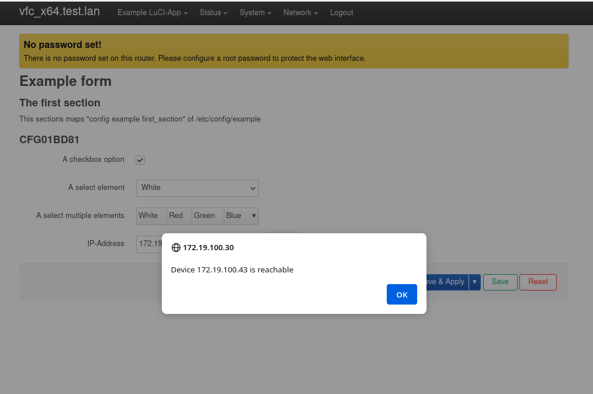
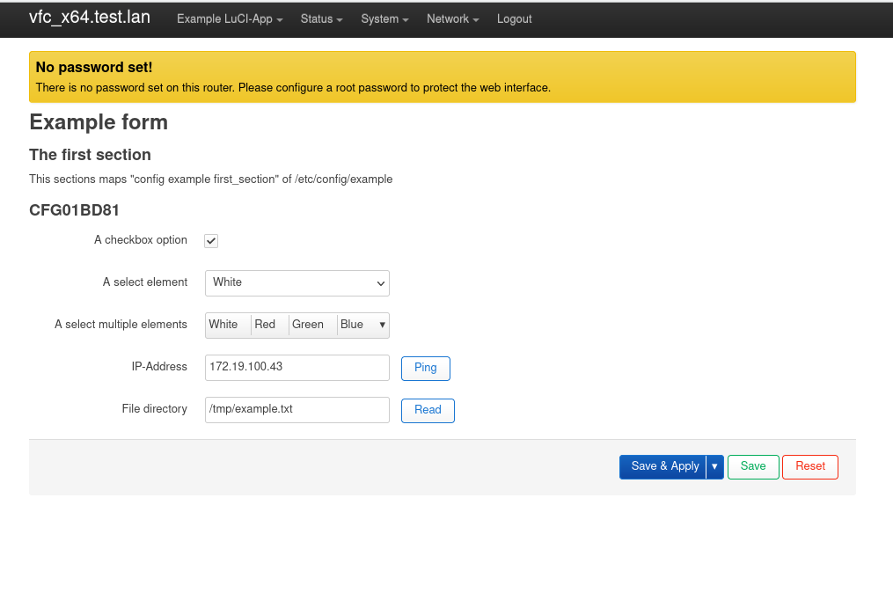
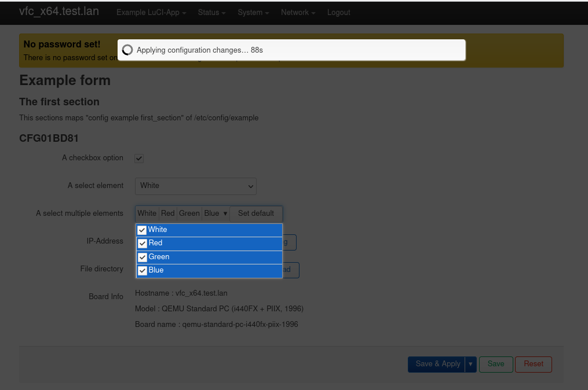
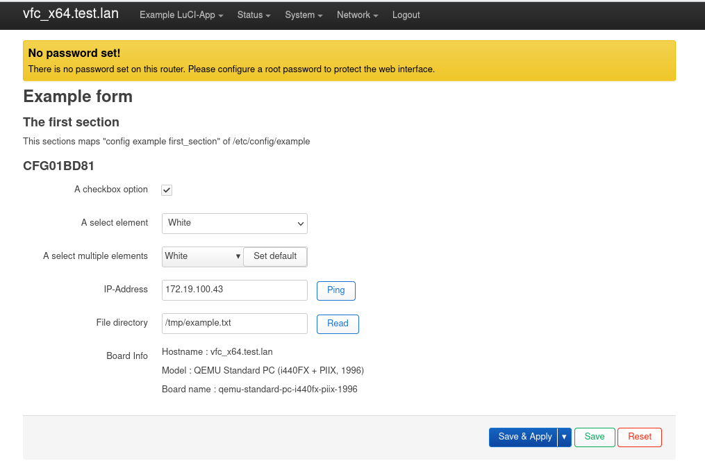

<!-- PROJECT LOGO -->
 

  

  <h3 align="center">Client side LuCI Documentation</h3>

  

    Writing a simple LuCI app with JavaScript API
     
  

<!-- TABLE OF CONTENTS -->

  
Table of Contents

  <ol>
    <li>
      <a href="#about-the-project">LuCI App Preview</a>
    </li>
    <li>
      <a href="#prerequisites">Prerequisites</a>
    </li>
    <li>
      <a href="#writingapp">Writing a LuCI App</a>
      <ul>
        <li><a href="#settingapp">Setting up</a></li>
        <li><a href="#form">Creating a form</a></li>
        <li><a href="#listvalue">ListValue</a></li>
        <li><a href="#multivalue">MultiValue</a></li>
        <li><a href="#pingbutton">Ping button and ui.ping</a></li>
        <li><a href="#readfile">fs.read + ui.showModal</a></li>
        <li><a href="#rpc">rpc call</a></li>
        <li><a href="#uciset">uci set changes</a></li>
        <li><a href="#poll">Dynamic page</a></li>
      </ul>
    </li>
 
  </ol>

<!-- LuCI App Preview -->
## LuCI App Preview

This tutorial will demonstrate how to create a simple LuCI form view using the JavaScript API

(<a href="#readme-top">back to top</a>)

<!-- Prerequisites -->
## Prerequisites

LuCI apps are typically developed for embedded Linux systems like routers, so you'll need access to such a system for testing and deployment. Here are the prerequisites and steps to get started:
  <ol>
    <li>
      Setup OpenWrt Environment:
      <ul>
        <li>You need access to an OpenWrt-based device, such as a router or a virtual machine running OpenWrt.</li>
        <li>Make sure you can SSH into your OpenWrt device and have basic knowledge of Linux commands.</li>
      </ul>
    </li>
    <li>
      LuCI Installed:
      <ul>
        <li>Ensure that LuCI (Luci web interface) is installed on your OpenWrt device. It is usually included in the default OpenWrt firmware.</li>
      </ul>
    </li>
    <li>
      Web Development Tools:
      <ul>
        <li>You'll need a text editor or Integrated Development Environment (IDE) for coding JavaScript. Popular choices include Visual Studio Code, Sublime Text, or even simple editors like Notepad++.</li>
      </ul>
    </li>
    <li>
      Basic JavaScript and Web Development Knowledge
    </li>
    <li>
      Familiarity with OpenWrt and LuCI
    </li>
  </ol>

(<a href="#readme-top">back to top</a>)

<!-- Writing App -->
## Writing an LuCI App

### Setting up

### Creating a form

### ListValue

### MultiValue

### Ping button and ui.ping

### fs.read + ui.showModal

### rpc call

### uci set changes

### Dynamic page

(<a href="#readme-top">back to top</a>)

<!-- MARKDOWN LINKS & IMAGES -->
<!-- https://www.markdownguide.org/basic-syntax/#reference-style-links -->
[contributors-shield]: https://img.shields.io/github/contributors/othneildrew/Best-README-Template.svg?style=for-the-badge
[contributors-url]: https://github.com/othneildrew/Best-README-Template/graphs/contributors
[forks-shield]: https://img.shields.io/github/forks/othneildrew/Best-README-Template.svg?style=for-the-badge
[forks-url]: https://github.com/othneildrew/Best-README-Template/network/members
[stars-shield]: https://img.shields.io/github/stars/othneildrew/Best-README-Template.svg?style=for-the-badge
[stars-url]: https://github.com/othneildrew/Best-README-Template/stargazers
[issues-shield]: https://img.shields.io/github/issues/othneildrew/Best-README-Template.svg?style=for-the-badge
[issues-url]: https://github.com/othneildrew/Best-README-Template/issues
[license-shield]: https://img.shields.io/github/license/othneildrew/Best-README-Template.svg?style=for-the-badge
[license-url]: https://github.com/othneildrew/Best-README-Template/blob/master/LICENSE.txt
[linkedin-shield]: https://img.shields.io/badge/-LinkedIn-black.svg?style=for-the-badge&logo=linkedin&colorB=555
[linkedin-url]: https://linkedin.com/in/othneildrew
[product-screenshot]: images/screenshot.png
[Next.js]: https://img.shields.io/badge/next.js-000000?style=for-the-badge&logo=nextdotjs&logoColor=white
[Next-url]: https://nextjs.org/
[React.js]: https://img.shields.io/badge/React-20232A?style=for-the-badge&logo=react&logoColor=61DAFB
[React-url]: https://reactjs.org/
[Vue.js]: https://img.shields.io/badge/Vue.js-35495E?style=for-the-badge&logo=vuedotjs&logoColor=4FC08D
[Vue-url]: https://vuejs.org/
[Angular.io]: https://img.shields.io/badge/Angular-DD0031?style=for-the-badge&logo=angular&logoColor=white
[Angular-url]: https://angular.io/
[Svelte.dev]: https://img.shields.io/badge/Svelte-4A4A55?style=for-the-badge&logo=svelte&logoColor=FF3E00
[Svelte-url]: https://svelte.dev/
[Laravel.com]: https://img.shields.io/badge/Laravel-FF2D20?style=for-the-badge&logo=laravel&logoColor=white
[Laravel-url]: https://laravel.com
[Bootstrap.com]: https://img.shields.io/badge/Bootstrap-563D7C?style=for-the-badge&logo=bootstrap&logoColor=white
[Bootstrap-url]: https://getbootstrap.com
[JQuery.com]: https://img.shields.io/badge/jQuery-0769AD?style=for-the-badge&logo=jquery&logoColor=white
[JQuery-url]: https://jquery.com 
