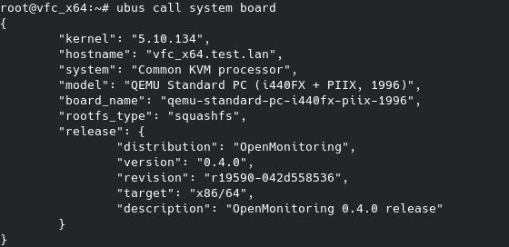

<!-- PROJECT LOGO -->
<br />
<div align="center">
  <a href="[OpenWRT Wiki](https://openwrt.org/start)">
      
  </a>

  <h3 align="center">Client side LuCI Documentation</h3>

  <p align="center">
    Writing a simple LuCI app with JavaScript API
    <br />
  </p>
</div>


<!-- TABLE OF CONTENTS -->
<details>
  <summary>Table of Contents</summary>
  <ol>
    <li>
      <a href="#luci-app-preview">LuCI App Preview</a>
    </li>
    <li>
      <a href="#prerequisites">Prerequisites</a>
    </li>
    <li>
      <a href="#writing-a-luci-app">Writing a LuCI App</a>
      <ul>
        <li><a href="#setting-up">Setting up</a></li>
        <li><a href="#creating-a-form">Creating a form</a></li>
        <li><a href="#loading-more-data">Loading more data</a></li>
        <li><a href="#custom-write-function">Custom write function</a></li>
        <li><a href="#custom-form-widget">Custom form widget</a></li>
        <li><a href="#rpc-communication">RPC Communication</a></li>
        <li><a href="#view-control">View control</a></li>
	<li><a href="#changing-uci-configuration-and-applying-changes">Changing UCI configuration and applying changes</a></li>
	<li><a href="#poll-actions">Poll actions</a></li>
      </ul>
    </li>
 
  </ol>
</details>


<!-- LuCI App Preview -->
# LuCI App Preview


LuCI JavaScript-API renders views on the client side, resulting in accelerated performance of the Web interface and offering developers more convenient tools for web interface creation.
This tutorial will demonstrate how to create a simple LuCI form view using the JavaScript API. Throughout this tutorial, it is recommended referring to the (API Reference)[https://openwrt.github.io/luci/jsapi/] for comprehensive details on the mentioned functions and classes.

<p align="right">(<a href="#readme-top">back to top</a>)</p>


<!-- Prerequisites -->
# Prerequisites

LuCI apps are typically developed for embedded Linux systems like routers, so you'll need access to such a system for testing and deployment. Here are the prerequisites and steps to get started:
  <ol>
    <li>
      Setup OpenWrt Environment:
      <ul>
        <li>You need access to an OpenWrt-based device, such as a router or a virtual machine running OpenWrt.</li>
        <li>Make sure you can SSH into your OpenWrt device and have basic knowledge of Linux commands.</li>
      </ul>
    </li>
    <li>
      LuCI Installed:
      <ul>
        <li>Ensure that LuCI (Luci web interface) is installed on your OpenWrt device. It is usually included in the default OpenWrt firmware.</li>
      </ul>
    </li>
    <li>
      Development Tools:
      <ul>
        <li>You'll need a text editor or Integrated Development Environment (IDE) for coding JavaScript. Popular choices include Visual Studio Code, Sublime Text, or even simple editors like Notepad++.</li>
      </ul>
    </li>
    <li>
      Basic JavaScript and Web Development Knowledge
    </li>
    <li>
      Familiarity with OpenWrt and LuCI
    </li>
  </ol>

<p align="right">(<href="#luci-app-preview">back to top</a>)</p>


<!-- Writing App -->
# Writing an LuCI App

## Setting up
*menu.d
You need this file routing
*acl.d
We will create an App that will use two uci files and txt file
  ```uci
config first_section
	option some_bool '1'
	option some_address '172.19.100.43'
	option some_file_dir '/tmp/example.txt'
  ```
  ```uci
config some_choice
	option id '1234'
	option choice 'Red'

config some_choice
	option id '4231'
	option descr 'Green'

config some_choice
	option id '4321'
	option descr 'Blue'
  ```
These files are:

The outer mysite/ root directory is a container for your project. Its name doesn’t matter to Django; you can rename it to anything you like.
manage.py: A command-line utility that lets you interact with this Django project in various ways. You can read all the details about manage.py in django-admin and manage.py.
The inner mysite/ directory is the actual Python package for your project. Its name is the Python package name you’ll need to use to import anything inside it (e.g. mysite.urls).
mysite/__init__.py: An empty file that tells Python that this directory should be considered a Python package. If you’re a Python beginner, read more about packages in the official Python docs.
mysite/settings.py: Settings/configuration for this Django project. Django settings will tell you all about how settings work.
mysite/urls.py: The URL declarations for this Django project; a “table of contents” of your Django-powered site. You can read more about URLs in URL dispatcher.
mysite/asgi.py: An entry-point for ASGI-compatible web servers to serve your project. See How to deploy with ASGI for more details.
mysite/wsgi.py: An entry-point for WSGI-compatible web servers to serve your project. See How to deploy with WSGI for more details.

## Creating a form
The following code maps the **example** configuration file

  ```js
'use strict';
'require form';

return L.view.extend({
    render: function () {
        var m, s, o;

        m = new form.Map('example', 'Example form');
        
        s = m.section(form.TypedSection, 'first_section', 'The first section',
            'This sections maps "config example first_section" of /etc/config/example');
        //s.anonymous = true;
        
        o = s.option(form.Flag, 'some_bool', 'A checkbox option');
        
        o = s.option(form.ListValue, 'some_choice', 'A select element');
        o.value('choice1', 'The first choice');
        o.value('choice2', 'The second choice');

        return m.render()
    }
});
  ```
This code is essentially defining a configuration form with two options: a checkbox option *('some_bool')* and a select element *('some_choice')* with two choices *('The first choice' and 'The second choice')*. The form is organized into sections, and the entire form is rendered when the 'render' function is called. The configuration data collected through this form is typically used to configure settings in the '/etc/config/example' configuration file. <br/>
Let's break down the code step by step:
  <ol> 	  
    <li>
	    
**'use strict'** is a JavaScript directive that enforces a stricter set of rules and prevents certain common programming mistakes. With strict mode, you can not, for example, use undeclared variables. [(Strict mode)](https://developer.mozilla.org/en-US/docs/Web/JavaScript/Reference/Strict_mode) 
    </li> 
    <li>
    
**'require form'**: This line is importing the form module, which is part of the LuCI framework. The form module provides functionality for creating configuration forms.      
    </li>  
    <li>

**return L.view.extend({ ... })**: This code defines a LuCI view by extending the 'L.view' class. In LuCI, views are used to display and manage different parts of the web interface, such as configuration pages.    
    </li>  
    <li>

Inside the **render** function, the following code creates a configuration form:
	<ul>
     	     <li>
	   **var m, s, o**: Declares three variables, 'm', 's', and 'o', which will be used to create and configure the form, form sections, and form options.
    	     </li>
	     <li>
	   **m = new form.Map('example', 'Example form')**: Creates a new instance of a form map with the name 'example' and the title 'Example form'. The form map is essentially the top-level container for all sections and options in the form.
    	     </li>
     	     <li>
	   **s = m.section(form.TypedSection, 'first_section', 'The first section', ...)**: Creates a new form section within the form map 'm'. This section is named 'first_section' and has a title 'The first section'. The section appears to be associated with a configuration section named 'config example first_section' in the '/etc/config/example' configuration file.
    	     </li>
     	     <li>
	   **o = s.option(form.Flag, 'some_bool', 'A checkbox option')**: Adds an option of type 'Flag' (likely a boolean checkbox) to the section 's'. This option is named 'some_bool' and has the label 'A checkbox option'.
    	     </li>
     	     <li>
	   **o = s.option(form.ListValue, 'some_choice', 'A select element')**: Adds another option of type 'ListValue' (likely a dropdown/select element) to the same section 's'. This option is named 'some_choice' and has the label 'A select element'.
    	     </li>
 	</ul>
    </li>
    <li>

**return m.render();** is used to render the entire form map 'm' along with its sections and options, and the rendered form is returned.   
    </li> 
  </ol>
  <br/>
  
To access the LuCI web interface enter the IP address of your OpenWRT in a web browser. Example: **http://192.168.1.1** 
<br/><br/>

<br/>
<p align="right">(<href="#luci-app-preview">back to top</a>)</p>
	
### Loading more data
Let's read values for ListValue from **example_helper** .
<br/><br/>
You can load UCI configuration data using the **uci** module before **render** function:

  ```js
//..
return L.view.extend({
    load: function () {
        return Promise.all([
            uci.load('example_helper')
        ]);
    },
    render: function () {   
        //..
        o = s.option(form.ListValue, 'some_choice', 'A select element');

        var choiceList = uci.sections('example_helper', 'some_choice')
        choiceList.forEach(choice => o.value(choice['id'], choice['name']));

        return m.render()
    }
});
  ```
<br/>
<ul>
	<li>
		
**load**: This function is used to load configuration data before rendering the form. It returns a Promise that resolves when the data is loaded.
	</li>
	<li>
**uci.sections('example_helper', 'some_choice')**: Retrievs a list of sections of type *'some_choice'* from the *'example_helper'*
 	</li>
</ul>

<br/>


<br/>
<p align="right">(<href="#luci-app-preview">back to top</a>)</p>

## Custom write function
It is possible to extend and override methods inherited from the **AbstractValue** class. Let's define custom **write** function for **MultiValue** class. <br/> Add following option to the section
  ```js
        o = s.option(form.MultiValue, "multi_choice", "A select multiple elements")
        choiceList.forEach(choice => o.value(choice['name']));
        o.display_size = 4;
  ```
Multivalue saves values by default in the following form:
  ```uci
list multichoice 'White'
list multichoice 'Red'
list multichoice 'Green'
  ```
To save **multi_choice** option like:
  ```uci
option multichoice 'White Red Green'
  ```
you can override the option's write function like this:
  ```js
        o.write = function (section_id, value) {
            uci.set('example', section_id, 'multi_choice', value.join(' '));
        }
  ```

## Custom form widget
Let's reate a  custom option value node that pings IP Address. To create new DOM Elements LuCI uses **E()** function which is alias for  [LuCI.dom.create()](https://openwrt.github.io/luci/jsapi/LuCI.dom.html#create)
First import **ui** and **dom**  modules. 

The following code defines a custom form widget named **CBIPingAddress** by extending the **form.Value** class. This custom widget is designed to render an input field along with a "Ping" button that allows you to test the connectivity of a network device using a given IP address or hostname:
  ```js
var CBIPingAddress = form.Value.extend({
    renderWidget: function (section_id, option_index, cfgvalue) {
        var node = this.super('renderWidget', [section_id, option_index, cfgvalue]);
        
        dom.append(node,
            E('button', {
                'class': 'btn cbi-button-edit',
                'id': 'custom-ping-button',
                'style': 'vertical-align: bottom; margin-left: 1em;',
                'click': ui.createHandlerFn(this, function () {
                    L.resolveDefault(ui.pingDevice('http', cfgvalue), 'error').then(
                        result => {
                            if (result === 'error') alert('ERROR: Device ' + cfgvalue + ' is not reachable');
                            else if (result === 'null') alert('The connectivity check timed out');
                            else alert('Device ' + cfgvalue + ' is reachable');
                        })
                        .catch((error) => {
                            alert(error)
                        });
                })
            }, 'Ping'))
        return node
    }
});
  ```
<ul>
	<li>
		
The **renderWidget** method is defined within the CBIPingAddress class. This method is responsible for rendering the HTML representation of the custom widget.
	</li>
	<li>
This line invokes the **renderWidget method of the parent class** (form.Value) using this.super(...). It passes the provided parameters to the parent method to get the initial HTML node for rendering the widget. This is a common pattern in JavaScript inheritance when you want to extend the behavior of a method defined in the parent class.
 	</li>
  	<li>
To create new DOM Elements LuCI uses **E()** method which is alias for  [LuCI.dom.create()](https://openwrt.github.io/luci/jsapi/LuCI.dom.html#create). To create nested elements just pass another **E** method as a third parameter.
	</li>
   	<li>
		
The **L.resolveDefault()** method is a convenient way in LuCI to call methods which return a Promise,  resolving with either the given value *(ui.pingDevice('http', cfgvalue))* or with the given default *(error)* in case the input value is a rejecting promise.
	</li>
		

</ul>
 
<br/>

To render the custom widget just pass **CBIPingAddress** as a first parameter to **s.option** method:
  ```js
  o = s.option(CBIPingAddress, 'some_address', 'IP-Address');
  ```
<br/>

<br/>
<p align="right">(<href="#luci-app-preview">back to top</a>)</p>
	
## RPC Communication
LuCI API offers some modules to interact with backend to enable RPC (Remote Procedure Call) communication with the router and its services like **LuCI.rpc**, **LuCI.fs** and **LuCI.uci**. 
Defining permissions for ubus methods, files, and uci configurations in a corresponding ACL (Access Control List) file is a crucial step.
Note: All RPC related methods return a Promise.

### Reading a file
This widget is uses **fs** module to read the content of a file specified by cfgvalue and displays it in a modal dialog. 
  ```js
  var CBIReadFile = form.Value.extend({
    renderWidget: function (section_id, option_index, cfgvalue) {
        var node = this.super('renderWidget', [section_id, option_index, cfgvalue]);
        dom.append(node,
            E('button', {
                'class': 'btn cbi-button-edit',
                'style': 'vertical-align: bottom; margin-left: 1em;',
                'click': ui.createHandlerFn(this, function () {
                    L.resolveDefault(fs.read(cfgvalue), 'Error: Could not read file').then(
                        result => {
                                ui.showModal(_('File Content'), [
                                    E('p', _(result)),
                                    E('div', { 'class': 'right' }, [
                                        E('button', {
                                            'class': 'btn cbi-button-edit',
                                            'click': ui.createHandlerFn(this, function () {
                                                ui.hideModal();
                                            })
                                        }, [_('Close modal')]),

                                    ])
                                ]);
                        })
                }),
            }, 'Read'))
        return node
    }
});
  ```
<br/>

<p align="right">(<href="#luci-app-preview">back to top</a>)</p>
<br/>
	
### RPC call
The **CBIBoardInfo** widget is used to display information about the router's hardware board, such as its hostname, model, and board name.

  ```js
  var boardInfo = rpc.declare({
    object: 'system',
    method: 'board',
    params: []
});

var CBIBoardInfo = form.TextValue.extend({
    renderWidget: function (section_id, option_index, cfgvalue) {
        var node = this.super('renderWidget', [section_id, option_index, cfgvalue]);
        
        L.resolveDefault(boardInfo(), 'unknown').then(function (result) {
            console.log(result)
            var contentNode = [
                E('p', {}, 'Hostname : ' + result['hostname']),
                E('p', {}, 'Model : ' + result['model']),
                E('p', {}, 'Board name : ' + result['board_name'])
            ]

            dom.content(node, contentNode)
        })

        return node
    }
});
  ```
<br/>

**var boardInfo = rpc.declare({ ... });** declares a function named boardInfo. It uses the rpc.declare function to wrap the following ubus call: 
<br/>

<br/>
**'params': []** indicates that the **'board'** method does not require any parameters. To call an ubus method with parameters specify their names in **params** Array as string. 
<br/>

<br/>
<p align="right">(<href="#luci-app-preview">back to top</a>)</p>
	
## View Control
To save changes made to a form you need click on **Save&Apply** button. It is possible to trigger **Save&Apply** button with Vanilla JavaScript or Jquery, but it's not considered an elegant approach.
**Save&Apply**, **Save** and **Reset** buttons are rendered by default. To remove them override **handleSaveApply**, **handleSave** and **handleReset** functions of **view** module by setting them to *null*:
```js
'use strict';
'require form';
'require uci';

return L.view.extend({
    load: function () {
        //..
    },
    render: function () {   
        //..
    },
    handleSaveApply: null,
    handleSave: null,
    handleReset: null
});
```
## Changing UCI configuration and applying changes
Let's extend the **MultiValue** widget by appending a button that will set **multi_choice** to *'White'*, then save and apply changes:
<br/>
  ```js
  var CBIMultiValue = form.MultiValue.extend({
    renderWidget: function (section_id, option_index, cfgvalue) {
        var node = this.super('renderWidget', [section_id, option_index, cfgvalue]);

        dom.append(node,
            E('button', {
                'class': 'btn cbi-button-default',
                'style': '',
                'click': ui.createHandlerFn(this, function () {

                    uci.set('example', section_id, 'multi_choice', 'White');
                    uci.save()
                        .then(L.bind(ui.changes.init, ui.changes))
                        .then(L.bind(ui.changes.apply, ui.changes))
                        .then(ui.hideModal());
                })
            }, 'Set default'))

        return node
    }
});
  ```
<br/>
The button handler function sets a configuration value, saves the changes, initializes changes using ui.changes.init, applies the changes using ui.changes.apply, and hides a modal dialog.


## Poll actions
The polling loop, powered by the **LuCI.poll** class, is often used in LuCI applications to periodically check for changes in configuration settings, monitor system status, or update the user interface with real-time information.
To create a simple example of displaying real-time updates using **poll** first define a function, which shows a current time.
<br/>
  ```js
function showCurrentTime() {
    var date = new Date().toLocaleString();

    var datetimeNode = E('p', {'class' : '', 'style': 'color: #004280;'}, date)
    $('h3').html(datetimeNode)
}
  ```
<br/>
And before calling m.render bind the **showCurrentTime** function to the current context and add it to **poll**, which will run every second. 
<br/>
  ```js
   var pollfunction = L.bind(showCurrentTime, this);
   poll.add(pollfunction, 1);
  ```
<br/>

<br/>

For more LuCI Framework Documentation: (References and HowTos)[https://github.com/openwrt/luci/wiki/Documentation]

<p align="right">(<a href="#readme-top">back to top</a>)</p>

